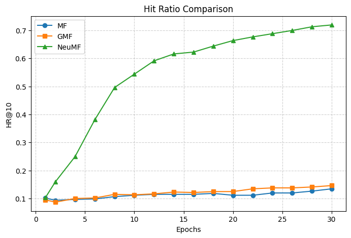

<body>
<header>
  <h1>Movie Recommendation System</h1>
  
Matrix Factorization (MF) · Generalized MF (GMF) · Neural MF (NeuMF)

  

    Implicit Feedback
    PyTorch
    HR@K / NDCG@K
  

</header>

  

    <h2>Table of Contents</h2>
    <a href="#overview">Overview</a>
    <a href="#structure">Project Structure</a>
    <a href="#data">Data & Preprocessing</a>
    <a href="#models">Models</a>
    <a href="#training">Training & Loss</a>
    <a href="#metrics">Evaluation</a>
    <a href="#results">Results</a>
    <a href="#run">How to Run</a>
    <a href="#next">Next Steps</a>
  

  <section id="overview" class="card">
    <h2>Overview</h2>
    
This project implements three collaborative filtering recommenders on MovieLens and compares them on ranking metrics.

    <ul>
      <li><b>Goal:</b> recommend top-K movies a user is likely to interact with.</li>
      <li><b>Feedback:</b> <i>implicit</i> — we treat ratings ≥ 4 as positives.</li>
      <li><b>Why implicit?</b> Real systems log clicks/plays more often than star ratings; ranking metrics reflect product goals better than RMSE.</li>
    </ul>
  </section>

  <section id="structure" class="card">
    <h2>Project Structure</h2>
<pre class="tree">recommendationSystem/
├── data/
│   ├── ratings.csv
│   └── movies.csv
├── evaluation/
│   ├── metrics.py        # HR@K, NDCG@K (and optional RMSE)
│   └── utils.py          # prepare_dataset, negative sampling, helpers
├── models/
│   └── model.py          # MFModel, GMFModel, NeuMFModel (PyTorch)
├── results/
│   ├── mf_model.pth, gmf_model.pth, neumf_model.pth
│   ├── mf_results.csv, gmf_results.csv, neumf_results.csv
│   ├── hr_plot.png, ndcg_plot.png
├── main.ipynb            # trains, evaluates, plots comparisons
└── README.md
</pre>
  </section>

  <section id="data" class="card">
    <h2>Data & Preprocessing</h2>
    <ul>
      <li>Dataset: MovieLens (ratings + movie metadata).</li>
      <li>Reindex users/items into contiguous IDs.</li>
      <li>Create implicit labels: <code>label = 1 if rating ≥ 4 else 0</code>.</li>
      <li>Split: <b>leave-one-out</b> — one positive per user held out for test.</li>
      <li>Training uses <b>negative sampling</b> to create (user, positive, negatives) pairs.</li>
    </ul>
  </section>

  <section id="models" class="card">
    <h2>Models</h2>
    

      

        <h3>MF (Matrix Factorization)</h3>
        
Score is the dot product of user & item embeddings.

        
Simple linear interactions; strong baseline.

      

      

        <h3>GMF (Generalized MF)</h3>
        
Elementwise product passed through a learned linear layer.

        
Reweights latent dimensions; still linear.

      

      

        <h3>NeuMF (Neural MF)</h3>
        
Fuses <b>GMF branch</b> (elementwise product) with an <b>MLP branch</b> (concat → non-linear layers) and a final head.

        
Captures both linear and non-linear user–item interactions.

      

    

  </section>

  <section id="training" class="card">
    <h2>Training & Loss</h2>
    <ul>
      <li>Optimizer: <code>Adam</code> (weight decay for regularization).</li>
      <li>Loss: <b>BCEWithLogitsLoss</b> over positives + sampled negatives (aligns with ranking).</li>
      <li>Sampling: typically 4–8 negatives per positive during training; ~100 sampled negatives/user for evaluation.</li>
    </ul>
    
We also experimented with explicit MSE training earlier; implicit training aligns better with ranking metrics.

  </section>

  <section id="metrics" class="card">
    <h2>Evaluation</h2>
    <ul>
      <li><b>HR@K</b> — Hit Ratio: whether the true held-out item appears in the top-K.</li>
      <li><b>NDCG@K</b> — rewards hits near the top more strongly.</li>
      <li class="muted">RMSE is included in utilities for explicit-rating experiments but isn’t used for implicit comparison.</li>
    </ul>
  </section>

  <section id="results" class="card">
    <h2>Results</h2>
    

      

      

    

     
    <table>
      <thead>
        <tr><th>Model</th><th>Best HR@10</th><th>Best NDCG@10</th><th>Notes</th></tr>
      </thead>
      <tbody>
        <tr><td>MF</td><td>= 0.1346 </td><td>= 0.0700</td><td>Linear baseline (dot product)</td></tr>
        <tr><td>GMF</td><td>= 0.1461</td><td>= 0.0719</td><td>Elementwise product + linear head</td></tr>
        <tr><td>NeuMF</td><td class="good">= 0.7192</td><td class="good">= 0.4854</td><td>GMF + MLP fusion (non-linear)</td></tr>
      </tbody>
    </table>
    
Your plots (attached) match expectations: NeuMF climbs rapidly and dominates; MF/GMF improve slowly.

  </section>

  <section id="run" class="card">
    <h2>How to Run</h2>
    <ol>
      <li>Install deps:
        <pre>pip install -r requirements.txt</pre>
      </li>
      <li>Place <code>ratings.csv</code> (and optional <code>movies.csv</code>) in <code>data/</code>.</li>
      <li>Open <code>main.ipynb</code> and run all cells:
        <ul>
          <li>Loads & preprocesses data (implicit labels, reindexing, leave-one-out split)</li>
          <li>Trains MF, GMF, NeuMF with BCE + negative sampling</li>
          <li>Evaluates HR@10 & NDCG@10 with sampled negatives</li>
          <li>Saves logs to <code>results/*.csv</code> and plots to <code>results/*.png</code></li>
        </ul>
      </li>
      <li>(Optional) Saved checkpoints are in <code>results/*.pth</code>.</li>
    </ol>
  </section>

  <section id="next" class="card">
    <h2>Next Steps</h2>
    <ul>
      <li>Hyper-parameter tuning (embedding size, negatives per positive, deeper MLP).</li>
      <li>Cold-start features (genres, text embeddings) and popularity fallback.</li>
      <li>Two-stage serving: ANN candidate retrieval + NeuMF ranking.</li>
      <li>Deploy with FastAPI + React; containerize with Docker; host on AWS/GCP.</li>
    </ul>
  </section>

  <footer class="card" style="text-align:center">
    
Built with PyTorch · Metrics: HR@K, NDCG@K

  </footer>

</body>
</html>